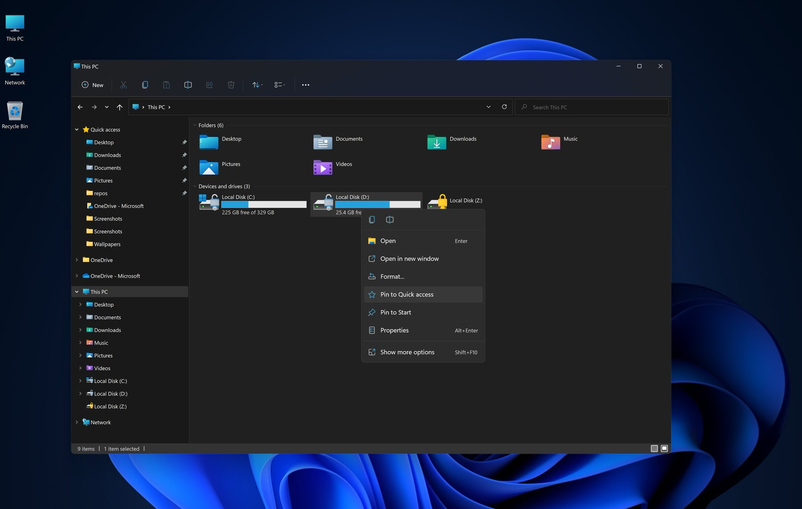
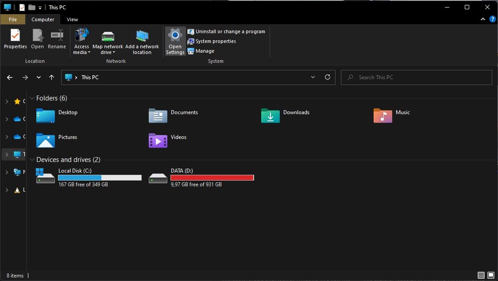
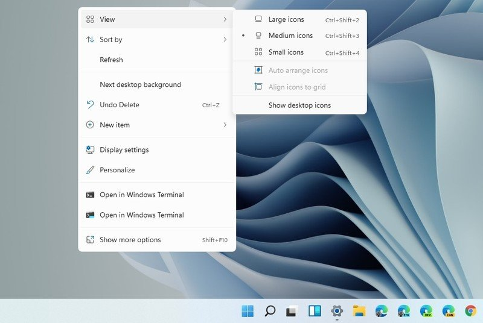
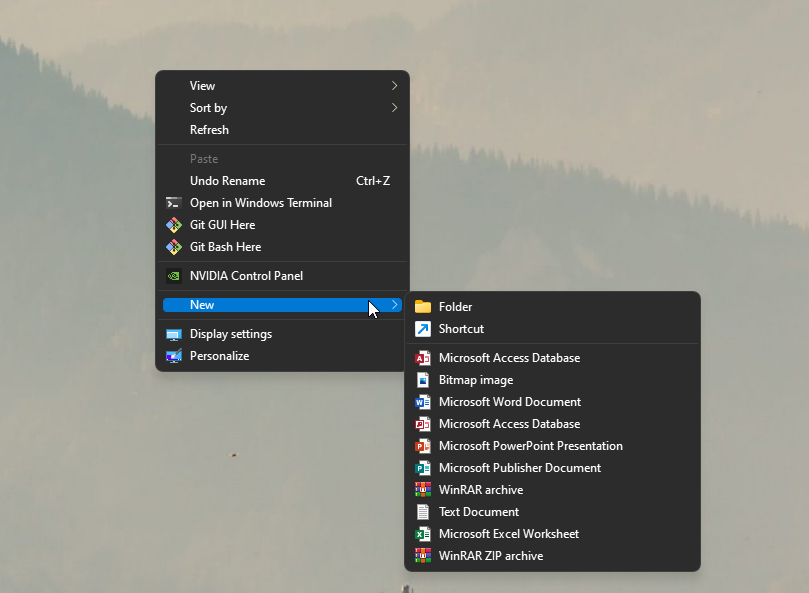

# Windows 11 Tweaks 

This repository contains registry files for Windows 11 Systems, to regain lost functionality and unlock the older Windows 10 functionality.

Double-clicking any of the files will apply the change. After that, you have to restart Windows Explorer through Task Manager to see the changes. 

- [Enable Old Explorer Design](##Enable-Old-Explorer-Design)
- [Enable Old Context Menu Design](##Enable-Old-Context-Menu)
# Enable Old Explorer Design
Installing `EnableOldExplorer.reg` will change the new explorer style to the old one found in Windows 10, with the old ribbon style. Click on the link below and then "Save Target as" in the context menu. 

<a href="https://raw.githubusercontent.com/NiHaiden/win11tweaks/main/EnableOldExplorer.reg">Click here to download</a>

Before applying the registry file: 

Image Credit: Microsoft

After applying the registry file: 

# Enable Old Context Menu
The new context menu in Windows 11 looks awesome. The bad thing right now is, a lot of apps were not updated for the new design and it requires to the hassle of clickíng "Show more options". Registry file `EnableOldContextMenu.reg` disables the new context menu.
Click on the link below and then "Save Target as" in the context menu. 

<a href="https://raw.githubusercontent.com/NiHaiden/win11tweaks/main/EnableOldContextMenu.reg">Click here to download</a>

Before applying the registry file: 

Image Credit: Windows Central

After applying the registry file: 
